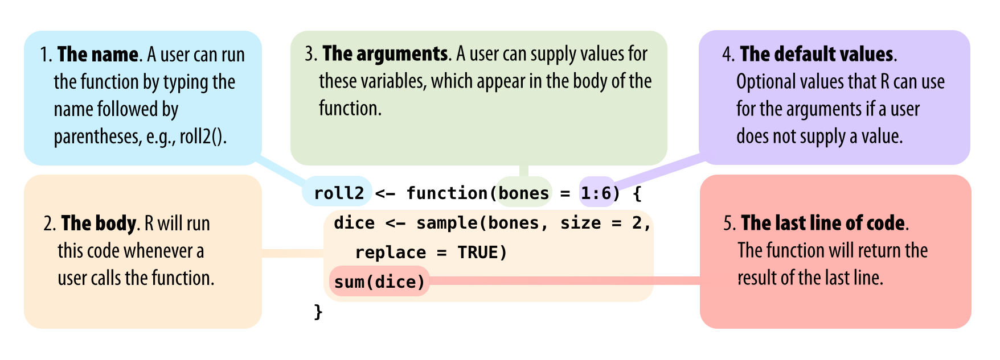

```{r setup, include=FALSE}
knitr::opts_chunk$set(echo = TRUE, warning = FALSE)
```
# Chapter 1: The Very Basics

Chapter 1 dari buku [**Hands-on Programming with R**](https://rstudio-education.github.io/hopr/). Catatan ini merupakan bagian dari proyek 1: **Weighted Dice**.

## The R User Interface
Tidak ada yang penting.

## Objects
Tidak ada yang penting.

## Functions
<!-- ====================  -->
<!-- Fungsi ke-1: round  -->
<!-- ====================  -->
`round` function is used to round a number.
```{r}
round(3.1415)
```

<!-- ======================== -->
<!-- Fungsi ke-2: factorial    -->
<!-- ========================  -->
`factorial` function is used to calculate the factorial of a number.
```{r}
factorial(3)
```

<!-- ======================== -->
<!-- Fungsi ke-3: mean    -->
<!-- ========================  -->
`mean` function is used to compute the mean of number(s).
```{r}
mean(1:6)
```

<!-- =========================== -->
<!-- Fungsi ke-4: round & mean    -->
<!-- ===========================  -->
We can combine `round` and `mean` functions as follows:
```{r}
round(mean(1:6))
```

## Sample with Replacement

<!-- =========================== -->
<!-- Fungsi ke-5: sample    -->
<!-- ===========================  -->
The `sample` function is used to sample.
```{r}
die <- 1:6
sample(x = die, size=1)
```


<!-- =========================== -->
<!-- Fungsi ke-6: args    -->
<!-- ===========================  -->
`args` can be used to view the arguments of a function.
```{r}
args(round)
args(sample)
```

<!-- =========================== -->
<!-- Fungsi ke-7: round    -->
<!-- ===========================  -->
`round` method can be accompanied with `digits`, for example:
```{r}
round(3.1415, digits = 2)
```

By **default**, the `sample` function is _without replacement_.
```{r}
sample(die, size=2)
```

When we want to `sample` _with replacement_, we can set `replace=TRUE` as follows:
```{r}
sample(die, size=2, replace = TRUE)
```

If you want to add up the dice, you can feed your result straight into the `sum` function:
```{r}
dice <- sample(die, size=2, replace = TRUE)
dice

sum(dice)
```

```{r}
die <- 1:6

```

## Writing Your Own Functions
We are going to write a function which returns the sum of rolling two dice.
```{r}
roll <- function(){
  die <- 1:6
  dice <- sample(die, size=2, replace = TRUE)
  sum(dice)
}
result <-  roll()
result
```
When you run a function in R, R will execute all of the code in the body and then return **the result of the last line of code**.

### The Function Constructor

## Arguments

{width=100%}
## Scripts

Menggunakan `qplot` dengan data pakai `c`.

```{r}
library("ggplot2")

x <- c(-1, -0.8, -0.6, -0.4, -0.2, 0, 0.2, 0.4, 0.6, 0.8, 1)
x
##  -1.0 -0.8 -0.6 -0.4 -0.2  0.0  0.2  0.4  0.6  0.8  1.0

y <- x^3
y
## -1.000 -0.512 -0.216 -0.064 -0.008  0.000  0.008  0.064  0.216 0.512  1.000

qplot(x,y)
```

## Summary


# Packages and Help Pages

## Packages
- Package `qplot` berarti quick plot. 
- Berikut adalah fungsinya dan `qplot` is a long function

```{r}
library(ggplot2)
qplot
```

- If you give `qplot` two vectors of equal lengths, `qplot` will draw a scatterplot for you. 
- `qplot` will use the first vector as a set of x values and the second vector as a set of y values.
-  Until now, we've been creating sequences of numbers with the `:` operator; but you can also create vectors of numbers with the `c` function.
- Give `c` all of the numbers that you want to appear in the vector, separated by a comma. `c` stands for **_concatenate_**, but you can think of it as "collect" or "combine"/


